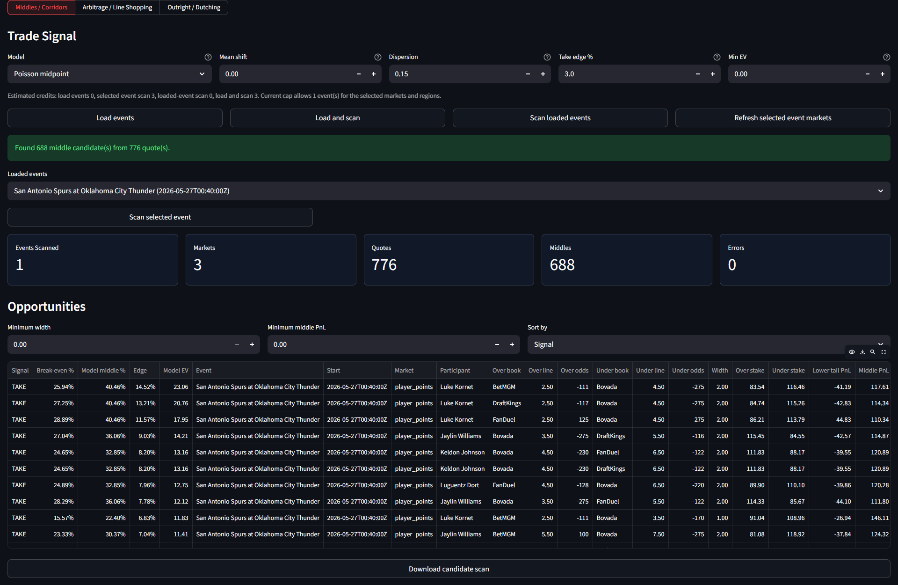
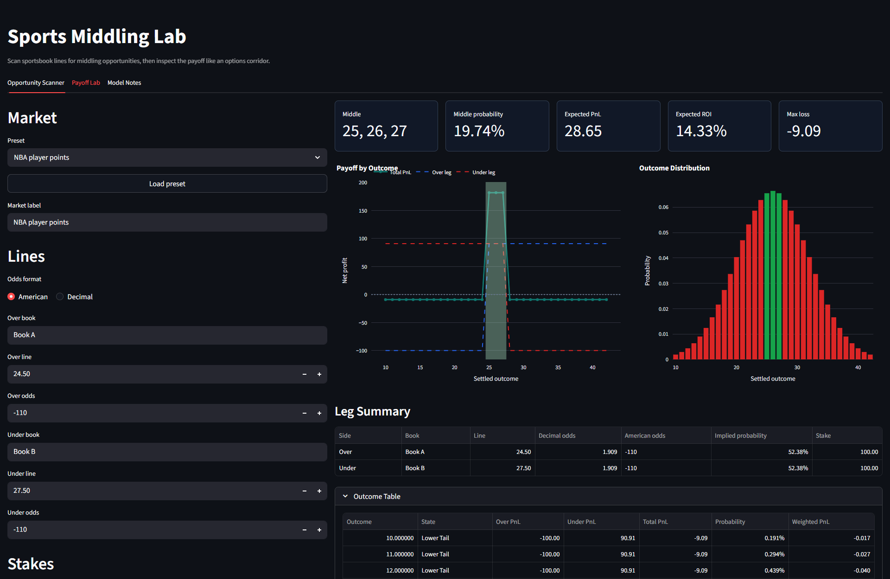
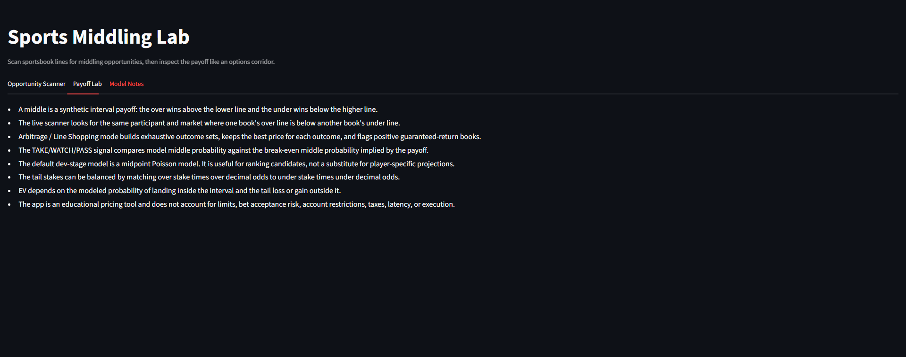

# Sports Middling Lab

A Streamlit research app for finding, explaining, and saving sports betting
market opportunities: middles, line-shopping/arbitrage, and outright dutching
portfolios.

The app is built like a small sports trading desk tool. It separates market
scanning from payoff analysis, guards The Odds API usage so a small monthly
quota is not burned accidentally, and lets a reviewer move from live market
scan to payoff chart to saved research log.

This project is not betting advice and does not claim guaranteed profit. It is a
pricing and research workflow for thinking about odds, probability, payoff
shape, execution risk, and model limitations.

Live app: [sports-middling-lab-ce.streamlit.app](https://sports-middling-lab-ce.streamlit.app/)



## What The App Does

Sports betting prices can differ across books. Sometimes those differences
create useful structures:

- A **middle**: one book offers a lower over line while another book offers a
  higher under line, so both bets can win if the result lands in the corridor.
- **Line shopping / arbitrage**: the best available prices across all outcomes
  may imply a low overround or, rarely, a theoretical guaranteed return.
- **Outright dutching**: selected runners in golf, motorsport, awards, or
  tournament markets can be staked as a partial portfolio with similar target
  payout if one selected runner wins.

The app helps you:

- scan selected sports, regions, and markets using The Odds API;
- protect API credits with explicit arming, per-click caps, and auto-trimming;
- rank candidates as `TAKE`, `WATCH`, or `PASS` under simple assumptions;
- inspect a middle as an options-style corridor payoff;
- save scan observations into a local SQLite research log;
- export saved research to CSV for later analysis.

## Screenshots

| API prompt | Live scan controls | Results table |
| --- | --- | --- |
|  |  |  |

| Payoff lab | Model notes |
| --- | --- |
|  |  |

## Quick Start

From the repository folder:

```powershell
python -m pip install -e .
python -m streamlit run app.py
```

Manual payoff analysis works without credentials. Live odds require a key from
[The Odds API](https://the-odds-api.com/).

## API Key Setup

For local development, create a private Streamlit secrets file:

```powershell
New-Item -ItemType Directory -Force .streamlit
Copy-Item .streamlit/secrets.example.toml .streamlit/secrets.toml
notepad .streamlit/secrets.toml
python -m streamlit run app.py
```

Set:

```toml
THE_ODDS_API_KEY = "your-key-here"
```

Never commit `.streamlit/secrets.toml`. It is ignored by git.

You can also paste a temporary key into the app while running locally. The app
does not save that key to the research database.

## Public Streamlit Deployment

The app is ready for Streamlit Community Cloud or a similar hosted Streamlit
service.

Recommended deployment settings:

```text
Repository: CiaranEarley/sports-middling-lab
Branch: main
Main file path: app.py
Dependency file: requirements.txt
```

Add the API key as a hosted secret, not as a committed file:

```toml
THE_ODDS_API_KEY = "your-key-here"
SPORTS_MIDDLING_PUBLIC_DEMO = true
SPORTS_MIDDLING_PUBLIC_MAX_CREDITS_PER_CLICK = 3
SPORTS_MIDDLING_PUBLIC_BUDGET = 500
SPORTS_MIDDLING_PUBLIC_RESERVE = 100
```

With `SPORTS_MIDDLING_PUBLIC_DEMO = true`, visitors can use the server-side key
without seeing it, but the API credit controls are locked so a visitor cannot
raise the per-click cap. Live calls are still disarmed by default and only run
after a button click.

The SQLite Research Log is useful locally. On a public hosted app, treat it as
demo persistence only; for durable multi-user storage, replace it with a hosted
database.

Full instructions are in [Deployment](docs/guides/deployment.md).

## App Layout

The app has four main tabs.

| Tab | Purpose |
| --- | --- |
| `Opportunity Scanner` | Live market scanner for middles, arbitrage/line-shopping, and outright dutching. |
| `Payoff Lab` | Manual over/under payoff model for understanding the corridor shape. |
| `Research Log` | Local SQLite store for saved scan observations, notes, statuses, and CSV export. |
| `Model Notes` | Plain-English explanation of the math, assumptions, and limitations. |

## Workflow 1: Use The Payoff Lab Without An API Key

Use this first if you want to understand middling before scanning live markets.

1. Open the `Payoff Lab` tab.
2. Choose a preset such as `NBA player points`.
3. Enter an over book, over line, and over odds.
4. Enter an under book, under line, and under odds.
5. Choose stake mode:
   - `Balanced total stake` splits the total stake across both legs.
   - `Manual stakes` lets you type each leg directly.
6. Choose a distribution model:
   - `Normal` is useful for many player props.
   - `Poisson` is useful for count-like outcomes.
   - `Negative Binomial` allows extra dispersion.
7. Review:
   - middle outcomes;
   - middle probability;
   - expected PnL;
   - expected ROI;
   - max loss;
   - outcome-by-outcome payoff table.

Example:

```text
Book A: Over 24.5 at -110
Book B: Under 27.5 at -110
Middle outcomes: 25, 26, 27
```

If the result lands on 25, 26, or 27, both legs win. Outside the corridor, one
side usually loses enough to create a small tail loss.

## Workflow 2: Scan Live Markets

Use the `Opportunity Scanner` tab when you want to look for current market
structures.

1. Add a server-side or temporary The Odds API key.
2. Keep `Arm live API calls` off while setting up the scan.
3. Choose sport, regions, days, and event count.
4. Choose market keys.
5. Choose market mode:
   - `Middles / Corridors`
   - `Arbitrage / Line Shopping`
   - `Outright / Dutching`
6. Review the estimated credit cost shown above the action buttons.
7. Turn on `Arm live API calls`.
8. Click one of:
   - `Load events`
   - `Load and scan`
   - `Scan loaded events`
   - `Scan selected event`
9. Review the candidate table.
10. Save useful displayed rows to the `Research Log`.

No odds scan happens on page load or refresh. The app only calls live odds
endpoints after you arm calls and click a scan button.

## API Quota Safety

The app was designed around a small free API quota.

| Control | What It Does |
| --- | --- |
| `Arm live API calls` | Prevents accidental live requests while configuring the page. |
| `Max/click` | Caps the estimated credit cost of a single click. |
| `Auto-trim` | Reduces event count so a batch scan stays under the cap. |
| `Monthly budget` | Tracks an estimated monthly allowance. |
| `Reserve` | Blocks scans that would consume the final protected quota. |
| Cached responses | Reduces repeated accidental calls during a short session. |

Sports and event discovery are low-risk or free endpoints. Odds scans and
event-market refreshes are the actions that spend credits.

## Market Modes

### Middles / Corridors

This mode searches for over/under line gaps for the same participant and market.

The scanner looks for:

```text
over line < under line
```

Example:

```text
Book A: Over 24.5 points
Book B: Under 27.5 points
Middle: 25, 26, 27
```

The app estimates:

- break-even middle probability;
- model middle probability;
- probability edge;
- expected value;
- lower-tail PnL;
- middle PnL;
- upper-tail PnL.

The key idea is that a middle is not automatically good. The middle probability
must be high enough to compensate for the tail loss and execution risk.

### Arbitrage / Line Shopping

This mode groups exhaustive outcome sets, keeps the best price for each outcome,
and calculates the total implied probability.

If the best prices across all outcomes sum below 100%, the setup is a
theoretical arbitrage before execution risk. If the sum is slightly above 100%,
it may still be useful as a low-overround line-shopping candidate.

Main risks:

- one leg moves before the other is placed;
- a book limits or rejects one stake;
- void or settlement rules differ;
- odds are stale;
- account restrictions prevent repeatability.

### Outright / Dutching

This mode is useful for markets such as golf, motorsport, awards, and tournament
winners where over/under props may not exist.

The app selects runners with attractive available prices and calculates stakes
that target a similar payout if any selected runner wins.

This is not risk-free. It is partial coverage. If an unselected runner wins, the
portfolio loses. Treat it as portfolio construction, not as a guaranteed-return
trade.

## How To Interpret `TAKE`, `WATCH`, And `PASS`

The labels are educational research signals, not execution instructions.

| Signal | Meaning |
| --- | --- |
| `TAKE` | The candidate clears the configured threshold under the app assumptions. |
| `WATCH` | The candidate is close enough to review, but not strong enough under current assumptions. |
| `PASS` | The payoff, price, or model estimate is not attractive enough. |

For middles, `TAKE` requires:

- model middle probability above break-even by the configured edge threshold;
- model EV above the configured minimum EV.

For arbitrage, `TAKE` means the best prices imply positive guaranteed profit
before execution risk.

For outrights, `TAKE` means the selected runner portfolio clears the app's
simple implied-probability and runner-count checks.

## Research Log

The `Research Log` tab is the first step toward building a historical dataset.

After a scan, click:

```text
Save displayed candidates to research log
```

or:

```text
Save displayed portfolios to research log
```

The app stores the visible rows in a local SQLite database:

```text
local_outputs/sports_middling_research.sqlite3
```

The database stores:

- timestamp;
- scan id;
- sport and region;
- market mode;
- market keys;
- opportunity type;
- signal;
- event;
- participant or group;
- books;
- lines;
- odds;
- stakes;
- model probability;
- break-even probability;
- edge;
- EV;
- implied probability;
- overround;
- legs as JSON;
- manual review status;
- notes;
- settlement comments.

The database does not store API keys. The database file is ignored by git.

To use a different database path:

```powershell
$env:SPORTS_MIDDLING_DB_PATH = "C:\Users\EarlT\Documents\my_middling_log.sqlite3"
python -m streamlit run app.py
```

In the Research Log tab you can:

- filter by signal, opportunity type, review status, and text search;
- export filtered rows to CSV;
- mark rows as `New`, `Watched`, `Taken`, `Ignored`, or `Settled`;
- add manual notes;
- add a final result or settlement note.

This does not create full backtesting by itself. It creates the saved sample
needed for later backtesting once enough observations and final outcomes have
been collected.

## Practical Example: Saving A Middle Candidate

1. Open `Opportunity Scanner`.
2. Choose `NBA`.
3. Select regions such as `us`.
4. Select prop market keys such as `player_points`, `player_rebounds`, or
   `player_assists`.
5. Choose `Middles / Corridors`.
6. Set a small event count while developing.
7. Arm live API calls.
8. Click `Load and scan`.
9. Review candidates.
10. Click `Save displayed candidates to research log`.
11. Open `Research Log`.
12. Filter to `TAKE` or `WATCH`.
13. Add notes such as:

```text
Interesting 2.5-point corridor, but check both books are still live before action.
```

Over time, repeated saved scans become a dataset for reviewing which candidate
types were actually worth attention.

## Practical Example: Golf Or Motorsport Outrights

1. Refresh available sports with `Include out-of-season sports` enabled.
2. Choose a golf, motorsport, or futures market if available.
3. Choose `Outright / Dutching`.
4. Use the `outrights` market key.
5. Set maximum runner count and maximum portfolio implied probability.
6. Scan a small number of events.
7. Review selected-runner portfolios.
8. Save interesting portfolios to the Research Log.

The important caveat is omitted-field risk. Dutching only pays if one of the
selected runners wins.

## Project Structure

```text
app.py                         Streamlit UI and workflow orchestration
sports_middling/middling.py     Payoff maths, odds conversion, EV summary
sports_middling/sports_odds_api.py
                               The Odds API adapters and candidate builders
sports_middling/research_log.py SQLite persistence for saved observations
tests/                          Unit tests for maths, API parsing, and storage
docs/assets/                    Screenshots
docs/guides/                    User guides
local_outputs/                  Local ignored database/output files
```

## Tests

Run the test suite:

```powershell
python -m unittest discover
```

The tests cover:

- odds conversion and middle payoff maths;
- The Odds API payload parsing;
- middle, arbitrage, and outright candidate generation;
- SQLite research-log save, duplicate handling, fetch, and review updates.

## Current Limitations

The app should be viewed as a live research and payoff-analysis tool, not a
fully backtested trading system.

- There is no large historical odds database yet.
- The Research Log only grows when a user deliberately saves scan results.
- Backtesting still needs final outcomes attached to saved observations.
- Closing-line value tracking requires repeated timestamped prices from entry to
  close, which is limited by the API-credit-protected workflow.
- The model probability for middles is simple and should not be treated as
  production alpha.
- The app does not fully simulate rejected bets, partial fills, book limits,
  stale prices, latency, or settlement mismatches.
- Sport-specific models for NBA props, MLB, tennis, golf, motorsport, and soccer
  would improve the quality of candidate ranking.

## Roadmap

Strong next upgrades:

- Add final-outcome entry fields tailored by sport and market.
- Add simple realized hit-rate analysis from the Research Log.
- Add closing-line snapshots when API quota allows.
- Add GitHub Actions for automated tests.
- Add sport-specific projection assumptions.
- Add execution-risk fields such as stake accepted, stake rejected, price moved,
  and one-leg fill.

## Additional Guides

- [Getting started](docs/guides/getting-started.md)
- [The Odds API setup](docs/guides/the-odds-api.md)
- [Deployment](docs/guides/deployment.md)
- [Interpreting the scanner](docs/guides/interpreting-sports-scanner.md)
- [Screenshot gallery](docs/guides/screenshot-gallery.md)

## Disclaimer

This is an educational pricing and research tool. It does not account for
bookmaker limits, account restrictions, void rules, latency, taxes, model error,
or execution failure. Do not treat app output as betting advice.
