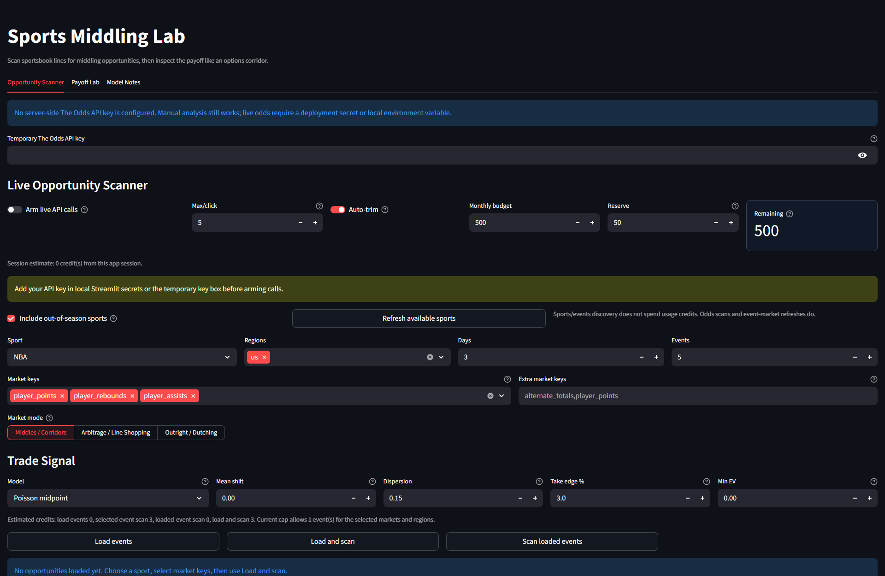
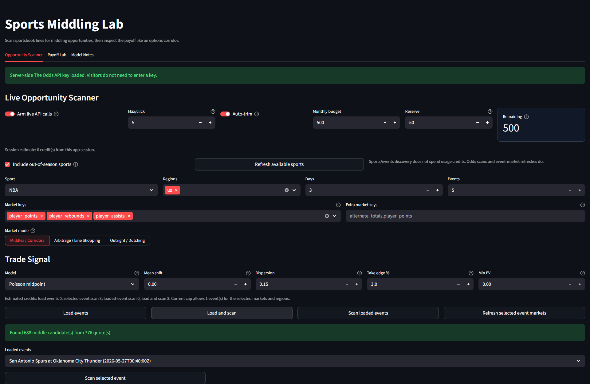

# The Odds API Setup

The app supports manual analysis without an API key. Live scanning requires a
The Odds API key.



## Local Secrets

```powershell
New-Item -ItemType Directory -Force .streamlit
Copy-Item .streamlit/secrets.example.toml .streamlit/secrets.toml
notepad .streamlit/secrets.toml
```

Set:

```toml
THE_ODDS_API_KEY = "your-key-here"
```

`.streamlit/secrets.toml` is ignored by git.

## Public Deployment

For a public demo with a small free plan, the safest setup is usually no
server-side key. Visitors can still use manual mode or enter their own temporary
key in the app.

A server-side key gives a smoother demo, but every visitor scan can spend your
quota. Keep live calls disarmed, keep the per-click cap low, and use a reserve.


